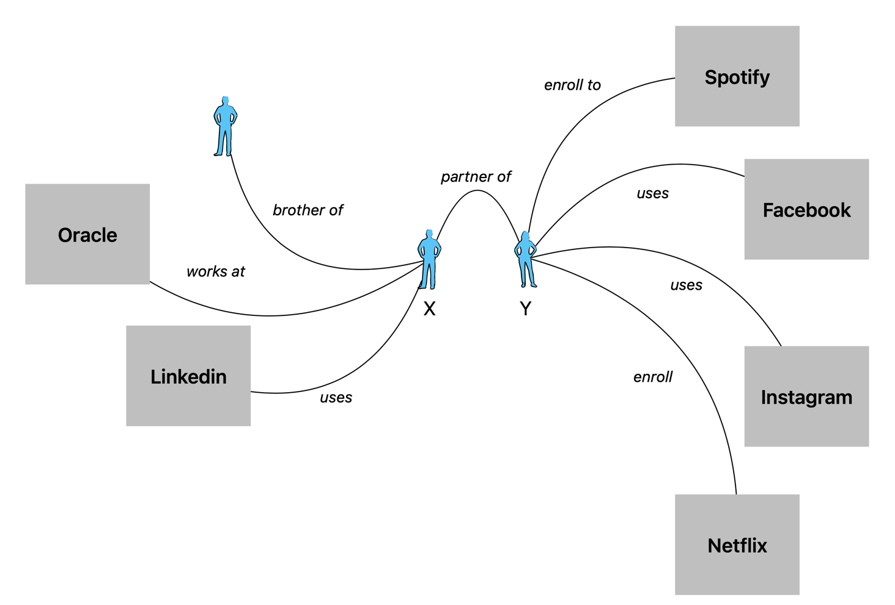
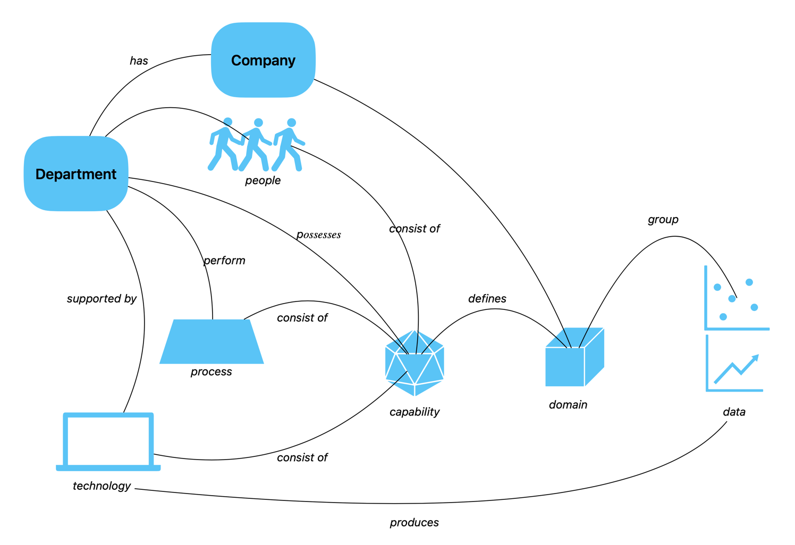
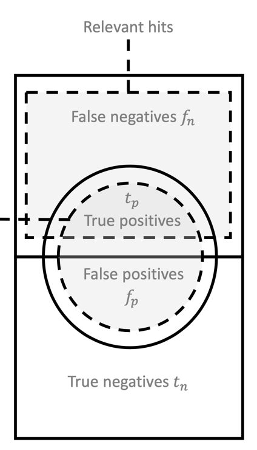
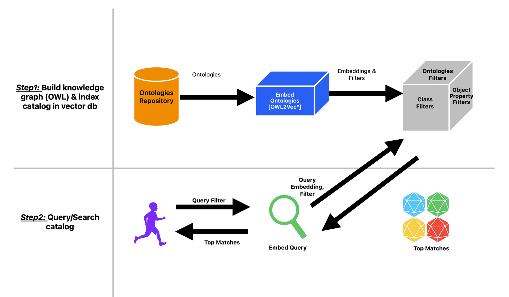
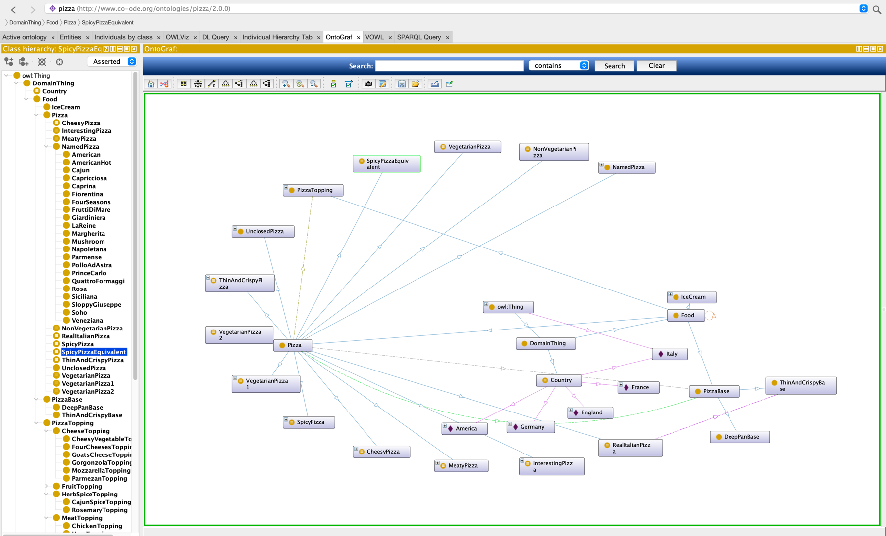
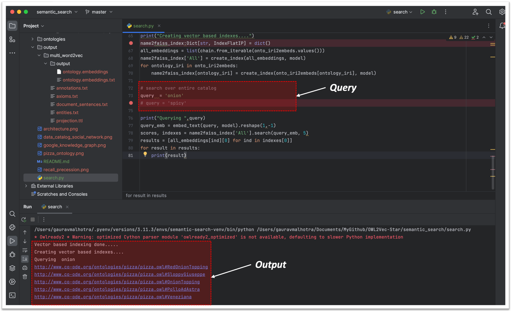

## Overview
Data is a fuel on which an organization depends on its operations/running, in other words, data is foundational to organisational operations. Data catalog are central to managing and utilizing data
assets. Data catalog provides an ability to search "for data", based on - name of the data assets,
its metadata plus related business terms. Hence, data catalog plays a critical role in "data discovery". However, most 
of the data catalog rely on "string matching" (using Lucene or Elastic search). These type of search,
lacks in understanding meaning and relationships of concepts in the catalogs. This leads to, missing
useful search hits on the data assets. With the rise of "Data Mesh", which proposes, data products (composition of data assets) are organized in "domains". 
This also poses another search challenge in a data catalog. 

So,how can we address this? Let's throw, the latest buzzwords - ChatGPT, LLM etc - potentially they can and will.

_However_ - I do believe, Data Catalog should be **_"Semantic Data Catalog"_**. In this blog, let's explore - **_"Semantic Data Catalog"_**.

## Semantic Data Catalog

A semantic search engine is based on _**semantic context**_ of _search queries_ and context is more desirable, to understand 
the meaning/knowledge. Semantic _search engines also uses the relationships between entities for returning search results_. This type
of search is based on **_"Knowledge Graph"_**. The Knowledge Graph is a semantic database in which information is 
structured in such a way that knowledge is created from the information. Here, entities (nodes) are related to each other 
via edges, provided with attributes and other information and placed in thematic context or ontologies.Entities are the 
central organizational element in semantic databases, such as Google’s Knowledge Graph.In addition to the relationships 
between the entities, Google uses data mining to collect attributes and other information about the entities and 
organizes them around the entities, as shown below:



The _**Semantic Data Catalog**_ addresses the challenges mentioned, in the overview section, **_by leveraging, the power of
ontologies, ontology embeddings and vector search to improve data discovery and management_**. _**A Data Catalog is a
social graph**_; hence plain search dos not help, knowledge graph driven based on ontology addresses this challenge.


**_The Semantic Data Catalog_** brings, following benefits: .
1. **Increase search accuracy and relevance**
    Build ontology based knowledge graph, which helps in understanding the meanings of _concepts_ and the _relationships_ 
    between them, a semantic data catalog provides  accurate and relevant search results. This can be measured using: Recall ,Precision
       
        

2. **Smarter data governance**
    With toolset like ontology driven knowledge graph, fueling deeper & clear understanding of the meanings as well as
    relationship of data concepts, _**a semantic data catalog provides an organization a tool to better manage and utilize
    their data._**
3. **Increased efficiency and productivity**
   Semantic data catalog makes "search for data" easier, leading towards "searching in data" (lakehouse). it not only
   increase productivity, as well as, efficiency

 NOTE: excessive metadata can have negative affect on search, as articulated by [Zipf Law](https://en.wikipedia.org/wiki/Zipf%27s_law)

## Semantic Data Catalog Architecture
1. **Step 1** The starting point is the **_ontology catalog_**, which stores ontology of each of the data assets.
2. **Step 2** Train an ontology embedding model on the catalog to generate numerical vectors, or embeddings, that 
              capture the knowledge/meanings and relationships of concept
3. **Step 3** Load embedding into a vector search engine, which allows users to search for data assets within the
              data catalog using textual queries.
4. **Step 4** A provided query, the model is used to embed query and use vector search engine to fetch the most
              relevant concepts


## Sample Ontology Graph
   For this blog, I will be us pizza owl from [Protege Stanford](https://protege.stanford.edu/ontologies/pizza/pizza.owl)



## Search 
In this blog, I will be using [Facebooks similarity based search package](https://faiss.ai). After the embedding have been
created, these embedding need to be loaded into vector search engine. It's worth full blow vector database like [Pinecode](https://www.pinecone.io)
or [Weaviate](https://weaviate.io)

### Vector Database
Allow you to store a representation of any object as a vector (text, images, audio, video, etc. That is, it stores data as high-dimensional vectors,
which are mathematical representations of features or attributes. A vector is, essentially, just a list of numbers. The amount of numbers, referred
to as dimensions, directly correlates to how much data a vector can represent. In our case the vectors we are interested in storing is a representation 
of the contextual meaning behind each and every word in the ontology.  Each vector has a certain number of dimensions, which can range from tens to 
thousands, depending on the complexity and granularity of the data. The vectors are usually generated by applying some kind of transformation or
embedding function to the raw data. The embedding function can be based on various methods, such as machine learning models, word embeddings,
feature extraction algorithms.
The main advantage of a vector database is that it allows for fast and accurate similarity search and retrieval of data based on their vector 
distance or similarity. This means that instead of using traditional methods of querying databases based on exact matches or predefined criteria,
you can use a vector database to find the most similar or relevant data based on their semantic or contextual meaning.

To perform similarity search and retrieval in a vector database, you need to use a query vector that represents your desired information or criteria.
The query vector can be either derived from the same type of data as the stored vectors. Then, you need to use a similarity measure that calculates
how close or distant two vectors are in the vector space. The similarity measure can be based on various metrics, such as cosine similarity, euclidean 
distance, hamming distance, jaccard index.

The result of the similarity search and retrieval is usually a ranked list of vectors that have the highest similarity scores with the query vector.
You can then access the corresponding raw data associated with each vector from the original source or index.

In 2023, there is a rising number of “vector databases” which are specifically built to store and search vector embeddings - some of the more popular ones include:
- Weaviate
- Milvus
- Qdrant
- Vespa
- Pinecon

### Embedding
An embedding is a relatively low-dimensional space into which you can translate high-dimensional vectors. Embeddings make it easier to do machine learning on large 
inputs like sparse vectors representing words. Ideally, an embedding captures some of the semantics of the input by placing semantically similar inputs close together
in the embedding space. An embedding can be learned and reused across models.
Embeddings can assist us in learning the semantic meaning of a word by studying what other words it often appears next to. 
Then we can produce a list of embeddings, which can be treated as a task-specific dictionary

## Model & Embedding
In this blog, I will be using [OWL2Vec2 - embedding of OWN ontology](https://arxiv.org/abs/2009.14654). There is refernce 
implementaiton from Oxford univeristy, which takes a catalog of ontologies and build a model that embed ontologies.

**NOTE**
1. The embedding produced is affected by the language model and ontology configurations (so it's recommended to expriment
    with embeddings)
2. Accuracy testing is not coverned. It's recommended to use - [MRR](https://en.wikipedia.org/wiki/Mean_reciprocal_rank),
   [Hit Rate](https://en.wikipedia.org/wiki/Hit_rate) (recall & precession)

## OUTPUT
The example provided following search examples as a demonstration:
NOTE: There is no limitation, please enter the query of your choice

```
query  = 'margherita and onion'
# query  = 'margherita'
# query  = 'mozzarella'
query  = 'onion'
# query = 'spicy'
# query  = 'onion'
# query  = 'spicy'
```
Below is the output:


## Summary
Semantic Data Catalog is the future and provide powerful capabilities to simplify data governance challleges of 
discoverability and increase efficiencies. Howeer, it is worth articulating challenges which need to be considered before 
taking it to production:
1. The outcome is dependent on the training of ontology model as well as maintaining its accuracy
2. The continuous evaluation of effectiveness of the embeddings and also updating the search indexes (vectors), as 
   the catalog is evolving

   


